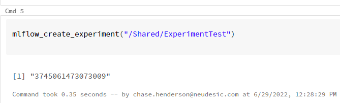

# Databricks and MLFlow in R

## Overview

This document will provide information related to how to train models using Databricks and MLFlow in R. When training a model the user often will need to use a Graphics Processing Unit (GPU), please make sure that the Databricks cluster is set up appropriately and is using an ML version of the runtime. Please note that a new runtime is released about every 6 months, and support for each runtime usually lasts 6 months unless the user selects a Long-Term Support runtime which is supported for 2 years.

## Install and Load Libraries

Prior to beginning an MLFlow run, please import mlflow and set the experiment context. This will allow the user to track each run within the experiment with ease.

## Create Experiment

An experiment directory needs to be initially created prior to setting and running experiments.

Two options for creating an experiment directory:

In a cmd cell:

Enter the following code:

mlflow_create_experiment(name,
  artifact_location = NULL,
  client = NULL,
  tags = NULL
)

In the tab bar:

Create an experiment only once.

To log runs the exeripment must be set each time.

## Set Experiment

Run this prior to starting an mlflow run.

## Begin Training¶

After setting the experiment, you can begin training. Depending on the type of model you are developing the requirements and architecture for the model will be different. However, there are some key mlflow commands we recommend looking into prior to the beginning of the training.

with(mlflow_start_run() is a useful commands when it comes to launching runs and logging metrics. Please see the MLFlow documentation for details on specific tracking functions. https://www.mlflow.org/docs/latest/R-api.html

Use the template below for starting and tracking a model.

        with(mlflow_start_run(), {
  
          model <- ModelType(y ~ x1 + x2, data = train_x)
          test$predictions <- predict(model, test)
  
          preds <- as.numeric(test$predictions)
          real <- as.numeric(test$y)

          mae <- mean(as.numeric(abs(test$predictions - test$y)), na.rm = TRUE)
          rmse <- sqrt(mean(as.numeric((test$predictions - test$y)), na.rm = TRUE))
          r2 <- cor(preds, real, use = "complete.obs") ^ 2

          message(" RMSE: ", rmse)
          message(" MAE: ", mae)
          message(" R2: ", r2)

          mlflow_log_metric("rmse", rmse)
          mlflow_log_metric("mae", mae)
          mlflow_log_metric("r2", r2)

          predictor <- carrier::crate(~ ModelLibrary::predict.ModelType(!!model, .x), !!model)
          mlflow_log_model(predictor, artifact_path="Model Title") 

        })
          }

For any questions about carrier::crate or uncommenting with "!!" please reference the following link:

**Crate::Carrier Documentation**
https://www.rdocumentation.org/packages/carrier/versions/0.1.0

Once the training begins, the user will be able to follow along with the model’s progress by clicking into the Experiment tab. This will take the user to another interface where you will be able to view various metrics and the model that gets saved from the run. Make sure the Machine Learning persona is selected. If the Experiments tab is not available it is likely because the persona is set to Data Science & Engineering or SQL.

# Registering the Model

Once you have determined your "best" model run it is important to register that model. The advantage of registering a model is it creates transparency for determining models in staging and production. Additionally, through registering a model it allows for rapid changes and deploying of updated and refined models without having to alter code written for prediction notebooks. 

